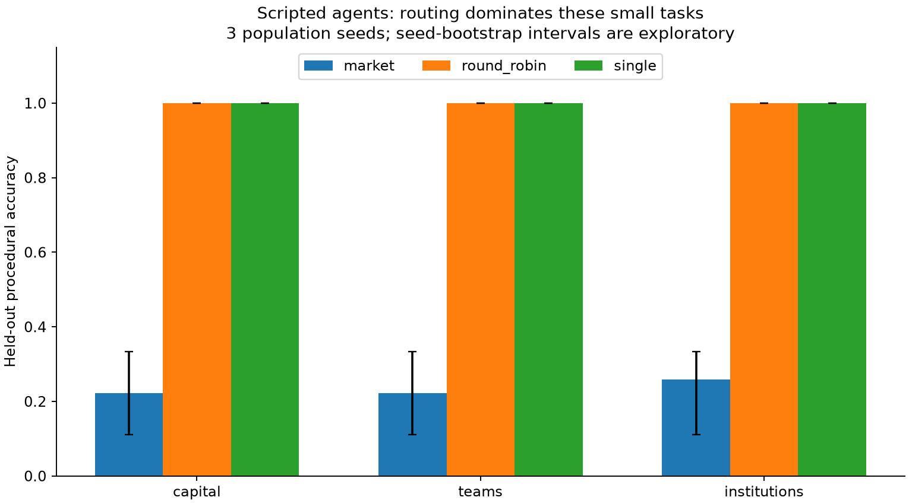
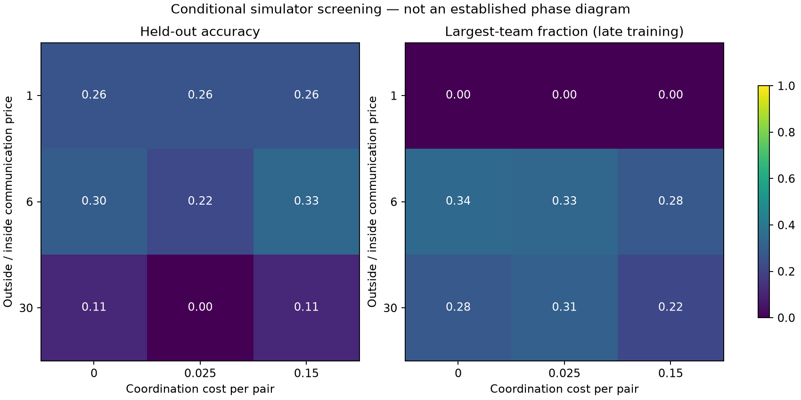

# Verified local results

These results use **scripted agents only**. No live LLM or GPU experiments have
been run, and no claim about LLM intelligence, optimal institutions, or emergent
norms follows from these numbers.

The final code fingerprint recorded by every verified matrix run is
`9b1fe644db9f71d037c1e2edc5a52d92aaddcff40791f0da779d6a3299be8ea5`.
Only the `runs/verified-*` outputs and `research/verified-results/` are used here.
Earlier `smoke`, `pilot`, and `final-*` directories are development artifacts.

## Verification

- **35 unittest checks passed**, covering accounting, bankruptcy, escrow, contract
  expiry, unique membership, information access, real byte bounds, exact grading,
  frozen evaluation, dataset partitions, provider HTTP requests, budget preflight,
  invalid JSON, error handling and interrupted-run recovery.
- **70 random graph checks** matched NetworkX's definitions for betweenness and
  modularity of the returned partition.
- Ruff checks passed for the engine, tests, GPU runner and result-plot script.
- **90 seeded matrix runs completed**: 27 mechanism-screen runs, 27 project/control
  runs, 12 institutional-ablation runs, and 24 cognitive-capital ablation runs.
- A real HiddenBench-loader smoke run completed (6 training + 4 test tasks), plus
  two frozen evaluation/removal runs. All used the scripted backend.
- The largest final ledger discrepancy across the 91 training runs was below
  `7.4e-12` credits, consistent with floating-point roundoff.
- The checkpoint test found and fixed a real dictionary-order/RNG bug. Reloaded
  populations now match uninterrupted training except for timing measurements.
- Plots were rendered and visually inspected. The pinned dependency versions are
  in `uv.lock`; the core engine also runs without those optional packages.

## Routing is the largest effect in this pilot

Each row uses three independently evolved populations (seeds 7, 17, 29), 24
training tasks, nine disjoint test tasks per seed, eight agents and at most 48
actions per task. The task mix is distributed sum, maximum and shortest path.

| Project | Market | Round-robin | Full-information single |
|---|---:|---:|---:|
| Cognitive capital | 22.2% | 100% | 100% |
| Labor market / teams | 22.2% | 100% | 100% |
| Adaptive institutions | 25.9% | 100% | 100% |

The scripted calculator is capable of solving these tasks once it has the
necessary evidence. The market's local cadence trigger can repeatedly admit a
high bidder without eliciting useful new information from others. Round-robin
ensures opportunities to transmit that information. This is a concrete diagnostic
failure of the current control policy, not a refutation of EoM's learned wake-up
predicates or evidence that round-robin is universally superior.

The next model experiment should compare `--llm-triggers` with the cadence
scaffold under equal total inference budgets. Action-only versus action-plus-
trigger LLM variants must account for all eligibility calls. Another useful future
control is a strictly local, information-change trigger.

## Team formation alone does not establish collective benefit

The mechanism screen varied outside communication cost over 0.03, 0.18, 0.90,
with inside cost fixed at 0.03, and coordination cost over 0, 0.025, 0.15.
The plotted team fraction is the mean largest-team share over the last ten training
episodes, then averaged over seeds.

At equal communication prices the scripted founding heuristic forms no teams.
That result is largely specified by its cost comparison and **must not be called
spontaneous discovery**. At larger ratios it forms small teams, but the most
expensive external communication often harms task performance. The displayed
conditions do not demonstrate monopoly, hierarchy, a cartel or a phase transition.

## Investment and institutional adaptation

The capital factorial used 16 train / 6 test tasks per seed. With evolution and
payments enabled, enabling scripted investment changes accuracy from 33.3% to
38.9%; the tiny seed count and broad intervals do not establish an advantage.
Without evolutionary replacement, all four corresponding settings scored zero,
which further exposes the fixed-bid/local-trigger bottleneck. Scripted reflection
only changes local strategy parameters; it never receives an oracle capability
improvement.

The institutional factorial used 24 train / 9 test tasks per seed:

| Rules | No training shock | Training workload shock |
|---|---:|---:|
| Fixed | 22.2% | 14.8% |
| Adaptive | 25.9% | 22.2% |

The point estimates favor the feedback heuristic in this small simulation, but
uncertainty intervals overlap. This supports running the intended controlled
experiment, not claiming that adaptive institutions have been validated.

For one teams population (seed 7), no removal, richest-agent removal and random
removal all scored 33.3% on nine test tasks. This single-population check exercises
the intervention path; it does not establish robustness or absence of brokerage.

## Real-data smoke and cost

The HiddenBench smoke scored 1/4 test items. The scripted policy picks the first
answer option, so this is only a loader/scoring/visibility check. The complete
dataset is present with 39/12/14 grouped train/validation/test items. Its adapted
protocol is not an official benchmark result.

All runs report zero live API calls and zero API dollars. SF Compute credits were
not accessed; its usage page required authentication. OpenRouter model catalogue
and SF Compute public API documentation were read without spending credits.

## Inspect and reproduce

- [Consolidated machine-readable results](research/verified-results/summary.json)
- [Project/control reports](runs/verified-project-study/report.html)
- [Mechanism-screen reports](runs/verified-phase-study/report.html)
- [Capital ablations](runs/verified-capital-ablation/report.html)
- [Institutional ablations](runs/verified-institution-study/report.html)
- [HiddenBench smoke](runs/verified-hiddenbench-smoke/report.html)

Run commands and live-provider instructions are in [README.md](README.md).
`research/summarize_verified.py` checks all engine hashes before rebuilding the
consolidated results and figures.
